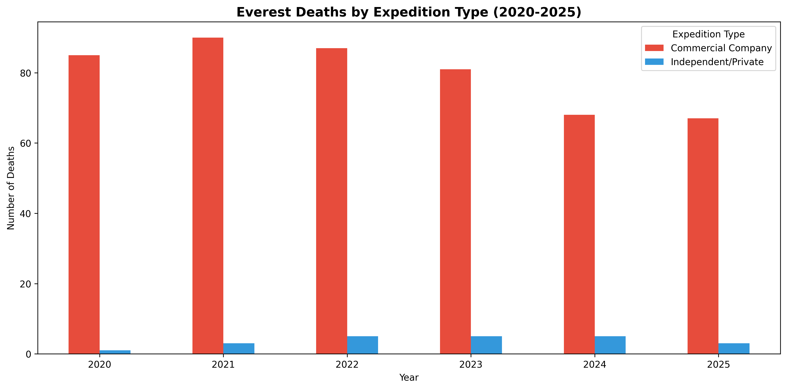
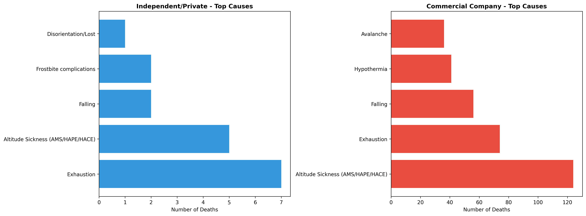
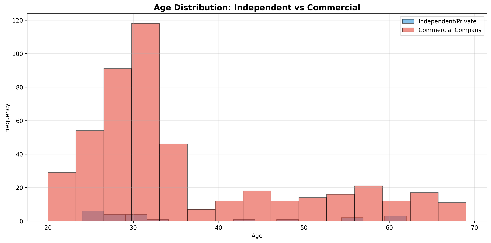
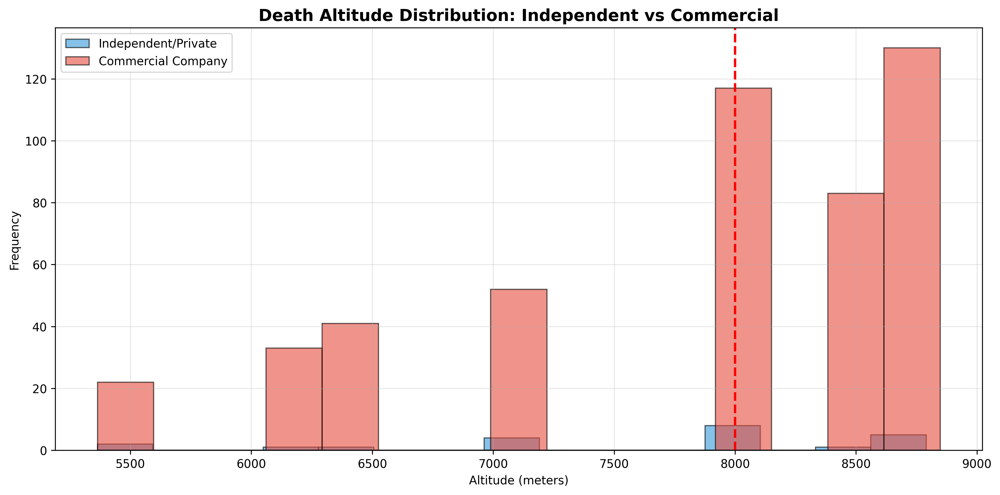
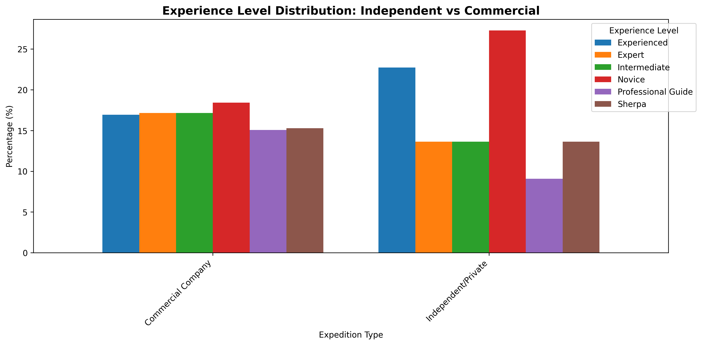

# Mountain Deaths Analysis: Statistical Trends and Predictions

## Overview

This project conducts a comprehensive statistical and machine learning analysis of mountaineering fatalities across the world's highest peaks. The study examines two primary datasets:

1. **Historical Deaths Across 14 Eight-Thousanders (1900s-2022)**: A comprehensive record of 1,033 deaths across all 14 mountains above 8,000 meters, including Everest, K2, Kangchenjunga, Lhotse, Makalu, Cho Oyu, Dhaulagiri I, Manaslu, Nanga Parbat, Annapurna I, Gasherbrum I, Gasherbrum II, Broad Peak, and Shishapangma. This dataset includes dates, nationalities, causes of death, and geographic coordinates.

2. **Everest-Specific Analysis (2020-2025)**: A detailed modern dataset focusing exclusively on Mount Everest deaths from 2020-2025, featuring enriched variables including climber age, gender, experience level, altitude of death, specific location, route taken, season, weather conditions, and expedition company affiliation.

### Analysis Components

**Statistical Trend Analysis**
- Linear and polynomial regression models examining death trends over time.
- Mountain-by-mountain regression analysis identifying which peaks show increasing vs. decreasing fatality rates.
- Temporal patterns including seasonal, annual, and decadal trends.
- Geographic distribution analysis of deaths by location.

**Machine Learning Classification**
- Predictive models attempting to forecast cause of death based on climber demographics, mountain characteristics, and environmental conditions.
- Comparison of 7 different ML algorithms (Random Forest, Gradient Boosting, Decision Tree, K-Nearest Neighbors, Naive Bayes, SVM, Logistic Regression)
- Feature importance analysis revealing which factors most strongly correlate with specific causes of death.
- Performance evaluation across both the comprehensive 14-mountain dataset and the focused Everest dataset.

**Expedition Company Risk Analysis**
- Comparative analysis of fatality patterns between independent/private climbers and commercial expedition companies.
- Examination of how expedition type correlates with cause of death, age distribution, altitude of death, experience level, and route selection.
- Statistical testing to identify significant differences in risk profiles between expedition types.

#### Key Research Questions

1. Are mountaineering deaths increasing or decreasing over time, both globally and on individual peaks?
2. Can we predict cause of death based on climber characteristics and environmental conditions?
3. Do independent climbers face different risks than those using commercial expedition companies?
4. Which factors (age, experience, route, season, weather) most strongly influence mountaineering fatalities?
5. Is there a relationship between climber age and the altitude at which they die?
6. How predictable are mountaineering deaths given available data?

This analysis combines traditional statistical methods with modern machine learning techniques to understand patterns in high-altitude mountaineering fatalities, evaluate the effectiveness of safety interventions and commercial expedition support, and quantify the limits of predictability in one of the world's most dangerous sporting pursuits.

-----------------------------------------------------

## Key Findings

### Statistical Significance
The upward trend in mountain deaths over time is statistically significant (p < 0.001), meaning this pattern is real and not due to chance, despite high year-to-year variability.

### Overall Trends (All Mountains Combined)
When analyzing all mountains together, we observe:
- **Linear Regression R² = 41.89%**: A straight-line model explains about 42% of death variance over time.
- **Polynomial (degree 2) R² = 42.98%**: Minimal improvement with quadratic modeling.
- **Polynomial (degree 3) R² = 49.87%**: Best fit, explaining nearly 50% of variance.

While the combined dataset shows a moderately predictable upward trend (R² = 42%), this demonstrates that global mountaineering deaths are increasing but remain substantially influenced by unpredictable factors such as weather conditions and catastrophic events.

### Individual Mountain Predictability
Individual mountains exhibit much lower predictability than the aggregate data, demonstrating that global mountaineering trends don't necessarily reflect patterns on specific peaks.

**No mountain achieved R² > 0.5**, meaning none have highly predictable death patterns. The most predictable mountain was:

**Annapurna I:**
- R² = 18.31% (linear), 24.31% (polynomial degree 3)
- p-value = 0.021 (statistically significant)
- Slope = -0.054 deaths/year (decreasing trend)
- This is the only mountain with both statistical significance (p < 0.05) and the highest R² value

Even on the most predictable mountain, deaths remain highly variable with 76% of variance unexplained by time-based models.

### Mountains with Increasing Death Trends
Seven mountains show positive slopes (deaths trending upward):
- **Everest**: +0.067 deaths/year (strongest increase, 311 total deaths)
- **Gasherbrum I**: +0.035 deaths/year (34 total deaths)
- **Makalu**: +0.012 deaths/year (40 total deaths)
- **K2**: +0.014 deaths/year (92 total deaths)
- **Dhaulagiri I**: +0.005 deaths/year (83 total deaths)
- **Broad Peak**: +0.006 deaths/year (35 total deaths)
- **Kangchenjunga**: +0.003 deaths/year (57 total deaths)

### Mountains with Decreasing Death Trends
Seven mountains show negative slopes (deaths trending downward):
- **Annapurna I**: -0.054 deaths/year (73 total deaths) - largest decrease
- **Nanga Parbat**: -0.042 deaths/year (85 total deaths)
- **Manaslu**: -0.041 deaths/year (86 total deaths)
- **Gasherbrum II**: -0.023 deaths/year (23 total deaths)
- **Shishapangma**: -0.017 deaths/year (31 total deaths)
- **Lhotse**: -0.013 deaths/year (31 total deaths)
- **Cho Oyu**: -0.006 deaths/year (52 total deaths)

The split between increasing and decreasing trends suggests safety improvements (better equipment, weather forecasting, rescue operations) may be working on some peaks, while increased traffic and accessibility are making others more dangerous.

-----------------------------------------------------

## Methodology

### Data Preparation
1. Combined 14 individual CSV files into a unified dataset.
2. Parsed dates with mixed formats using pandas.
3. Extracted temporal features (year, month, decade).
4. Handled missing values and data quality issues.

### Statistical Analysis
1. **Descriptive Statistics**: Frequency counts, distributions, and cross-tabulations
2. **Linear Regression**: Fitted straight-line models to identify trends
3. **Polynomial Regression**: Tested degree 2 and 3 polynomials for better fit
4. **Individual Mountain Analysis**: Separated analysis for each peak
5. **Future Projections**: Extended models 10 years forward

### Evaluation Metrics
- **R² (Coefficient of Determination)**: Measures how much variance the model explains (0-100%)
- **P-value**: Tests statistical significance (p < 0.05 = significant)
- **Slope**: Rate of change in deaths per year

-----------------------------------------------------

## Visualizations

### Overall Trends
- Deaths by Mountain (Bar Chart)

- Deaths by Nationality (Horizontal Bar Chart)

- Deaths by Cause (Bar Chart)

- Deaths Over Time (Line Chart)

- Deaths by Month - Seasonal Pattern (Line Chart)

- Causes of Death by Mountain (Grouped Bar Chart)

### Regression Analysis
- Linear vs Polynomial Regression Comparison (All Mountains)

- 10-Year Future Projection (All Mountains)

- Everest: Linear vs Polynomial Regression

- Annapurna I: Linear vs Polynomial Regression

### Distribution Analysis
- Top Causes of Death (Pie Chart)

- Death Distribution Across Mountains (Pie Chart)

## Key Insights

### Unpredictability of Mountain Deaths
Despite observable trends, mountain deaths remain largely unpredictable. Even the best models explain less than 50% of variance, indicating that factors beyond simple time trends drive fatalities:
- Extreme weather events
- Avalanches and natural disasters
- Volume of climbers attempting summits
- Experience levels of expeditions
- Geopolitical factors affecting access

### The Everest Effect
Everest accounts for 30% of all deaths (311 of 1,033) and shows the strongest increasing trend (+0.067 deaths/year). This likely reflects:
- Increased commercialization of Everest expeditions
- Growing accessibility to inexperienced climbers
- Congestion at key bottlenecks (e.g., Hillary Step)

### Safety Improvements vs Increased Traffic
The divergence between mountains with increasing vs decreasing death trends suggests a complex interplay between:
- **Improving safety**: Better gear, forecasting, communication, rescue
- **Increasing risk**: More climbers, inexperienced expeditions, climate change effects

## Expedition Company Analysis: Independent/Private Company vs Commercial Company (2020-2025)

This analysis examines the differences in death patterns between independent/private climbers and those using commercial expedition companies on Everest from 2020-2025.

-----------------------------------------------------

### Key Findings

#### 1. Death Trends Over Time

Commercial expeditions account for significantly more deaths than independent climbers, though this likely reflects the higher volume of commercial climbers. Notably, commercial deaths appear to be decreasing over the 2020-2025 period, following a similar pattern to independent deaths but at consistently higher absolute numbers.

#### 2. Causes of Death: Critical Differences

**Independent/Private Climbers:**
- **Primary cause**: Exhaustion (highest)
- **Secondary cause**: Altitude sickness (AMS/HAPE/HACE)
- **Notable**: Disorientation/Lost appears in the top 5 causes
- **Avalanche risk**: Not in top 5 causes

**Commercial Expeditions:**
- **Primary cause**: Altitude sickness (AMS/HAPE/HACE)
- **Secondary cause**: Exhaustion
- **Notable**: Avalanche ranks 5th
- **Disorientation/Lost**: Not in top 5

The presence of "disorientation/lost" among independent climbers suggests navigation and route-finding challenges when climbing without commercial guide support. Commercial climbers appear more vulnerable to avalanche risk, possibly due to fixed route exposure on popular climbing seasons.

#### 3. Age Distribution Patterns

Both expedition types show peak mortality in the mid-20s to mid-30s age range. However, independent climbers exhibit a higher concentration of deaths in the mid-20s compared to commercial expeditions, suggesting younger climbers may be attempting independent ascents without sufficient experience or support infrastructure.

#### 4. Altitude of Death

Both independent and commercial climbers show higher death rates at extreme altitudes, with the majority of fatalities occurring above 8,000 meters (the "Death Zone"). The distributions are remarkably similar, indicating that altitude-related physiological challenges affect both groups equally regardless of support level.

#### 5. Experience Level Analysis

**Commercial Expeditions:**
- Deaths distributed relatively evenly across all experience levels.
- **Novice climbers** show the highest death rate.
- Suggests commercial companies accept climbers with varying experience levels.

**Independent Climbers:**
- **Novice** deaths are by far the highest.
- **Experienced** climbers rank second.
- **Professional guides and Sherpas** show lower death rates in both groups.
- The sharp drop-off suggests independent climbing self-selects for more experienced mountaineers, but novices attempting independent climbs face particularly high risk.

### Implications

1. **Commercial expeditions may attract less experienced climbers** who rely on guide support, leading to higher vulnerability to altitude sickness.
2. **Independent climbers face greater navigation risks**, evidenced by "disorientation/lost" as a unique cause of death.
3. **Age and experience don't fully protect climbers**: Deaths occur across all demographics, though younger, less experienced climbers face elevated risk.
4. **The Death Zone (8,000m+) remains equally lethal** regardless of expedition support type.

These findings suggest that while commercial support provides route-finding and logistical advantages, it does not eliminate the fundamental physiological challenges of extreme altitude climbing.

-----------------------------------------------------

## Machine Learning Analysis of 14 Mountains

We tested 7 different machine learning models to predict cause of death based on mountain, year, month, and nationality:

**Best Model: Random Forest (53.14% accuracy)**

While 53% may seem modest, this significantly outperforms random guessing and demonstrates that causes of death are partially predictable based on these factors. The model identified **year** as the most important feature (37.7%), suggesting that mountaineering risks and common causes of death have evolved over time, likely due to changing equipment, weather patterns, volume of climbers in expeditions, and climber experience levels.

Feature importance ranking:
1. Year (37.7%) - Temporal trends in death causes
2. Nationality (27.3%) - Cultural/experience factors
3. Mountain (19.4%) - Peak-specific hazards
4. Month (15.6%) - Seasonal patterns

The relatively low accuracy highlights the unpredictable nature of mountain deaths, with many factors beyond our dataset (weather conditions, individual decisions, equipment failure) playing crucial roles.

-----------------------------------------------------

## Linear Regression and Machine Learning Analysis (Everest 2020-2025)

#### 1. Death Trends Over Time (2020-2025)

**Linear Regression: R² = 65.16%**
- A straight-line model explains about 65% of death variance over this period
- **Slope: -4.17 deaths/year** - Deaths are decreasing by approximately 4 per year
- **P-value: 0.0522** - Just barely not statistically significant (p > 0.05)
- The small 6-year sample size (2020-2025) limits statistical power

**Polynomial Regression: R² = 89.63%**
- A curved model fits much better, explaining nearly 90% of variance
- Suggests deaths aren't declining in a straight line, but following a curved pattern
- This could indicate accelerating improvements in safety

**Interpretation:** Everest deaths appear to be declining from 2020-2025, with strong model fit (especially polynomial). However, the trend isn't quite statistically significant due to the short time period analyzed. More years of data would be needed to confirm this as a genuine long-term trend rather than short-term fluctuation.

#### 2. Age vs Death Altitude Analysis

**R² = 0.0001 (essentially 0%)**
- **Slope: 0.79 meters per year of age** - Negligible relationship
- **P-value: 0.8268** - Not statistically significant

**Interpretation:** There is **no meaningful relationship** between a climber's age and the altitude at which they die. Older climbers do not die at lower altitudes, nor do younger climbers push higher before succumbing. Death altitude appears to be determined by route, conditions, and circumstances rather than the climber's age. The "Death Zone" (above 8,000m) is equally lethal regardless of age.

#### 3. Predicting Cause of Death (Classification)

**Best Model: Logistic Regression (23.20% accuracy)**

All machine learning models performed poorly at predicting cause of death:
- **Random Forest**: 99.7% train / 17.6% test - Severe overfitting
- **Gradient Boosting**: 97.6% train / 12.8% test - Severe overfitting  
- **Decision Tree**: 99.7% train / 12.0% test - Severe overfitting
- **K-Nearest Neighbors**: 40.8% train / 20.0% test - Better generalization but still poor
- **Logistic Regression**: 27.2% train / 23.2% test - Most consistent (winner by default)

**Why such low accuracy?**
1. **Small sample size** - Only a few years of data limits learning.
2. **High variability** - Causes of death are influenced by many unmeasured factors (weather events, individual decisions, equipment failures).
3. **Rare causes** - Some causes only occur once or twice, making them impossible to predict.
4. **Missing critical variables** - Real-time weather data, climbing speed, acclimatization schedules, and health conditions aren't in the dataset.

**Interpretation:** Cause of death on Everest is **highly unpredictable** even with detailed climber information (age, experience, route, season, weather, expedition type). While 23% is better than random guessing (~7-10% with 10+ causes), it demonstrates that individual circumstances and chance play dominant roles in mountaineering fatalities.

#### 4. Predicting Death Altitude (Regression)

**Best Model: Linear Regression (MAE: 837 meters)**

All models failed to predict death altitude:
- **Linear Regression**: R² = -0.003, MAE = 837m - No predictive power
- **Gradient Boosting**: R² = -0.19, MAE = 910m - Worse than baseline
- **Random Forest**: R² = -0.22, MAE = 932m - Worse than baseline
- **Decision Tree**: R² = -0.93, MAE = 1,023m - Catastrophic overfitting

**Negative R² values mean the models perform worse than simply guessing the average altitude every time.**

**Mean Absolute Error (MAE) of 837m means:**
- Predictions are off by an average of 837 vertical meters
- This is massive - it's like predicting someone dies at Camp 4 (8,000m) when they actually die near the summit (8,849m).

**Interpretation:** Death altitude on Everest **cannot be predicted** from climber characteristics alone. Altitude of death depends on:
- Where problems occur (equipment failure, sudden weather)
- Route taken and objectives
- Specific hazards encountered (crevasse, avalanche location, fixed rope condition)
- Individual physiological responses to altitude
- Rescue feasibility at that location

### Overall Machine Learning Conclusions

The poor performance of ML models on this dataset reveals an important truth: **Everest deaths are fundamentally unpredictable events** driven by complex interactions between human factors, environmental conditions, and chance. 

While we can identify risk factors and trends in aggregate data (via descriptive statistics and basic regression), predicting individual outcomes remains beyond current modeling capabilities with available data. This underscores the inherent danger of high-altitude mountaineering, even experienced climbers with commercial support face unpredictable risks.

**Key Takeaway:** Deaths are declining (2020-2025 trend), but each individual death remains largely unpredictable based on measurable climber and expedition characteristics.

-----------------------------------------------------

## Technologies Used
- Python 3.x
- pandas (data manipulation)
- NumPy (numerical computations)
- matplotlib (visualizations)
- scipy (statistical analysis)

## Future Work
- Analyze relationship between nationality and mountain choice
- Investigate correlation between cause of death and specific mountains
- Examine seasonal patterns in more detail
- Incorporate additional variables (expedition size, guide ratios, weather data)

## Data Sources
Kaggle dataset containing historical records of deaths on the 14 highest mountains in the world.

## Author
Kerry Wehner

