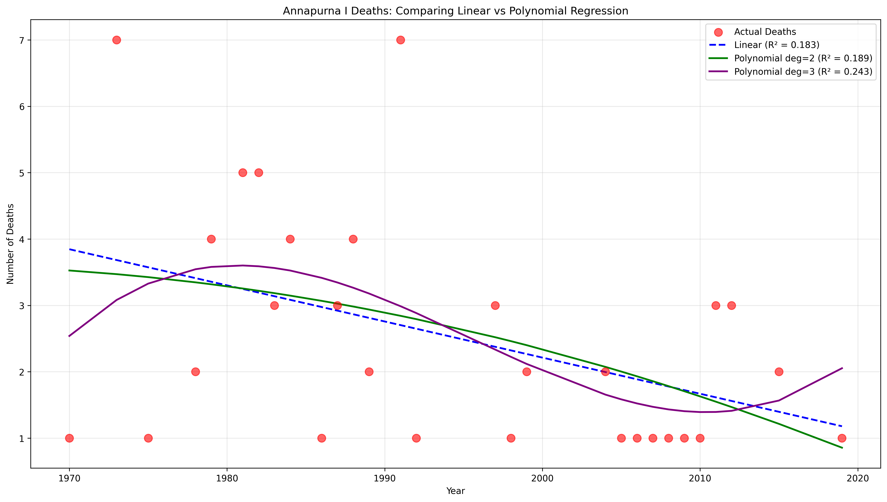
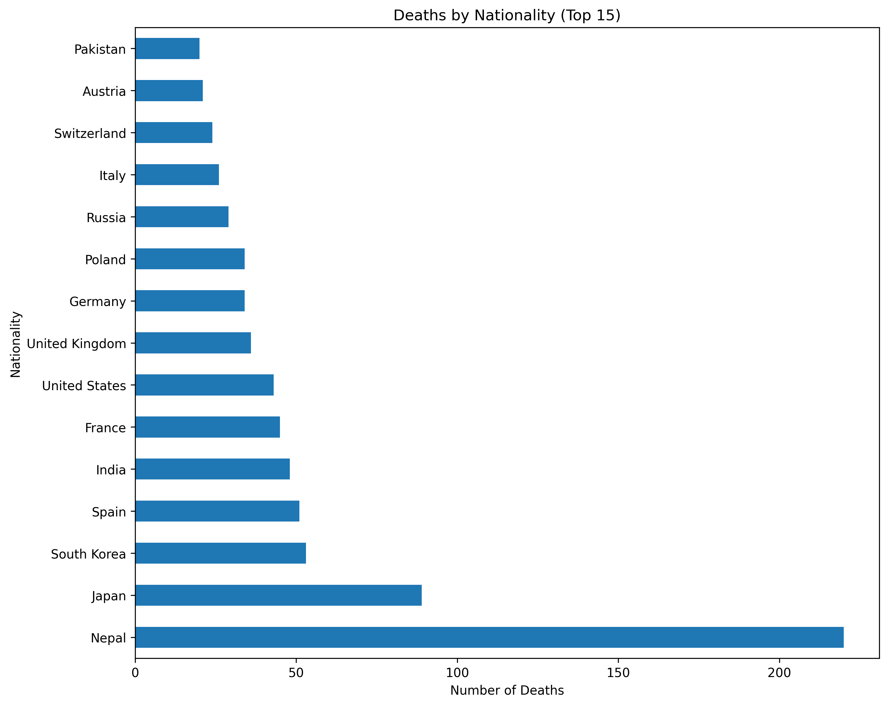
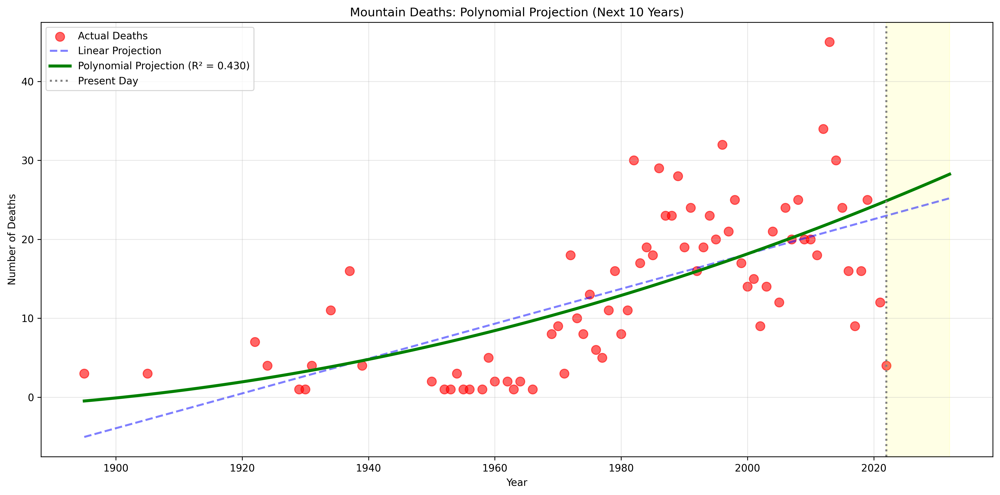
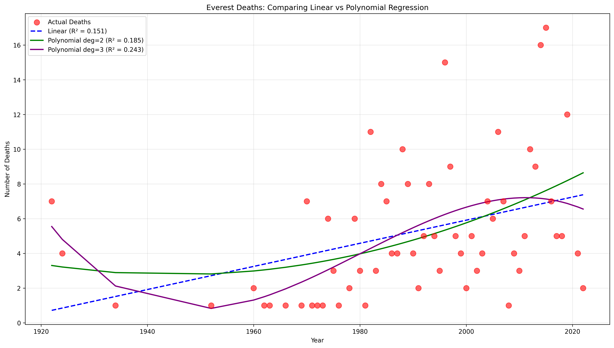
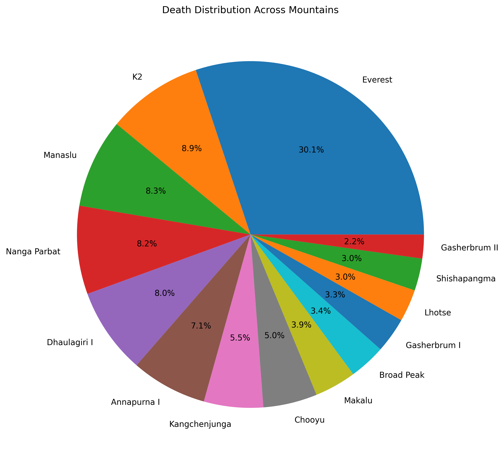

# Mountain Deaths Analysis: Statistical Trends and Predictions

## Overview
This project analyzes historical death records across the 14 highest mountains in the world (the "Eight-thousanders" plus notable peaks). The dataset includes information on dates, nationalities, causes of death, and geographic coordinates for deaths occurring on these peaks from the early 1900s to 2022.

## Dataset
The analysis covers 14 mountains from 1895 - 2022:
- Everest (311 deaths)
- K2 (92 deaths)
- Manaslu (86 deaths)
- Nanga Parbat (85 deaths)
- Dhaulagiri I (83 deaths)
- Annapurna I (73 deaths)
- Kangchenjunga (57 deaths)
- Cho Oyu (52 deaths)
- Makalu (40 deaths)
- Broad Peak (35 deaths)
- Gasherbrum I (34 deaths)
- Lhotse (31 deaths)
- Shishapangma (31 deaths)
- Gasherbrum II (23 deaths)

**Total Deaths Analyzed:** 1,033

## Key Findings

### Statistical Significance
The upward trend in mountain deaths over time is statistically significant (p < 0.001), meaning this pattern is real and not due to chance, despite high year-to-year variability.

### Overall Trends (All Mountains Combined)
When analyzing all mountains together, we observe:
- **Linear Regression R² = 41.89%**: A straight-line model explains about 42% of death variance over time.
- **Polynomial (degree 2) R² = 42.98%**: Minimal improvement with quadratic modeling.
- **Polynomial (degree 3) R² = 49.87%**: Best fit, explaining nearly 50% of variance.

While the combined dataset shows a moderately predictable upward trend (R² = 42%), this demonstrates that global mountaineering deaths are increasing but remain substantially influenced by unpredictable factors such as weather conditions and catastrophic events.

### Individual Mountain Predictability
Individual mountains exhibit much lower predictability than the aggregate data, demonstrating that global mountaineering trends don't necessarily reflect patterns on specific peaks.

**No mountain achieved R² > 0.5**, meaning none have highly predictable death patterns. The most predictable mountain was:

**Annapurna I:**
- R² = 18.31% (linear), 24.31% (polynomial degree 3)
- p-value = 0.021 (statistically significant)
- Slope = -0.054 deaths/year (decreasing trend)
- This is the only mountain with both statistical significance (p < 0.05) and the highest R² value

Even on the most predictable mountain, deaths remain highly variable with 76% of variance unexplained by time-based models.

### Mountains with Increasing Death Trends
Seven mountains show positive slopes (deaths trending upward):
- **Everest**: +0.067 deaths/year (strongest increase, 311 total deaths)
- **Gasherbrum I**: +0.035 deaths/year (34 total deaths)
- **Makalu**: +0.012 deaths/year (40 total deaths)
- **K2**: +0.014 deaths/year (92 total deaths)
- **Dhaulagiri I**: +0.005 deaths/year (83 total deaths)
- **Broad Peak**: +0.006 deaths/year (35 total deaths)
- **Kangchenjunga**: +0.003 deaths/year (57 total deaths)

### Mountains with Decreasing Death Trends
Seven mountains show negative slopes (deaths trending downward):
- **Annapurna I**: -0.054 deaths/year (73 total deaths) - largest decrease
- **Nanga Parbat**: -0.042 deaths/year (85 total deaths)
- **Manaslu**: -0.041 deaths/year (86 total deaths)
- **Gasherbrum II**: -0.023 deaths/year (23 total deaths)
- **Shishapangma**: -0.017 deaths/year (31 total deaths)
- **Lhotse**: -0.013 deaths/year (31 total deaths)
- **Cho Oyu**: -0.006 deaths/year (52 total deaths)

The split between increasing and decreasing trends suggests safety improvements (better equipment, weather forecasting, rescue operations) may be working on some peaks, while increased traffic and accessibility are making others more dangerous.

## Methodology

### Data Preparation
1. Combined 14 individual CSV files into a unified dataset.
2. Parsed dates with mixed formats using pandas.
3. Extracted temporal features (year, month, decade).
4. Handled missing values and data quality issues.

### Statistical Analysis
1. **Descriptive Statistics**: Frequency counts, distributions, and cross-tabulations
2. **Linear Regression**: Fitted straight-line models to identify trends
3. **Polynomial Regression**: Tested degree 2 and 3 polynomials for better fit
4. **Individual Mountain Analysis**: Separated analysis for each peak
5. **Future Projections**: Extended models 10 years forward

### Evaluation Metrics
- **R² (Coefficient of Determination)**: Measures how much variance the model explains (0-100%)
- **P-value**: Tests statistical significance (p < 0.05 = significant)
- **Slope**: Rate of change in deaths per year

## Visualizations

### Overall Trends
- Deaths by Mountain (Bar Chart)

- Deaths by Nationality (Horizontal Bar Chart)

- Deaths by Cause (Bar Chart)

- Deaths Over Time (Line Chart)

- Deaths by Month - Seasonal Pattern (Line Chart)

- Causes of Death by Mountain (Grouped Bar Chart)

### Regression Analysis
- Linear vs Polynomial Regression Comparison (All Mountains)

- 10-Year Future Projection (All Mountains)

- Everest: Linear vs Polynomial Regression

- Annapurna I: Linear vs Polynomial Regression

### Distribution Analysis
- Top Causes of Death (Pie Chart)

- Death Distribution Across Mountains (Pie Chart)

## Key Insights

### Unpredictability of Mountain Deaths
Despite observable trends, mountain deaths remain largely unpredictable. Even the best models explain less than 50% of variance, indicating that factors beyond simple time trends drive fatalities:
- Extreme weather events
- Avalanches and natural disasters
- Volume of climbers attempting summits
- Experience levels of expeditions
- Geopolitical factors affecting access

### The Everest Effect
Everest accounts for 30% of all deaths (311 of 1,033) and shows the strongest increasing trend (+0.067 deaths/year). This likely reflects:
- Increased commercialization of Everest expeditions
- Growing accessibility to inexperienced climbers
- Congestion at key bottlenecks (e.g., Hillary Step)

### Safety Improvements vs Increased Traffic
The divergence between mountains with increasing vs decreasing death trends suggests a complex interplay between:
- **Improving safety**: Better gear, forecasting, communication, rescue
- **Increasing risk**: More climbers, inexperienced expeditions, climate change effects

## Machine Learning Analysis

We tested 7 different machine learning models to predict cause of death based on mountain, year, month, and nationality:

**Best Model: Random Forest (53.14% accuracy)**

While 53% may seem modest, this significantly outperforms random guessing and demonstrates that causes of death are partially predictable based on these factors. The model identified **year** as the most important feature (37.7%), suggesting that mountaineering risks and common causes of death have evolved over time, likely due to changing equipment, weather patterns, volume of climbers in expeditions, and climber experience levels.

Feature importance ranking:
1. Year (37.7%) - Temporal trends in death causes
2. Nationality (27.3%) - Cultural/experience factors
3. Mountain (19.4%) - Peak-specific hazards
4. Month (15.6%) - Seasonal patterns

The relatively low accuracy highlights the unpredictable nature of mountain deaths, with many factors beyond our dataset (weather conditions, individual decisions, equipment failure) playing crucial roles.

## Technologies Used
- Python 3.x
- pandas (data manipulation)
- NumPy (numerical computations)
- matplotlib (visualizations)
- scipy (statistical analysis)

## Future Work
- Analyze relationship between nationality and mountain choice
- Investigate correlation between cause of death and specific mountains
- Examine seasonal patterns in more detail
- Incorporate additional variables (expedition size, guide ratios, weather data)

## Data Sources
Kaggle dataset containing historical records of deaths on the 14 highest mountains in the world.

## Author
Kerry Wehner

