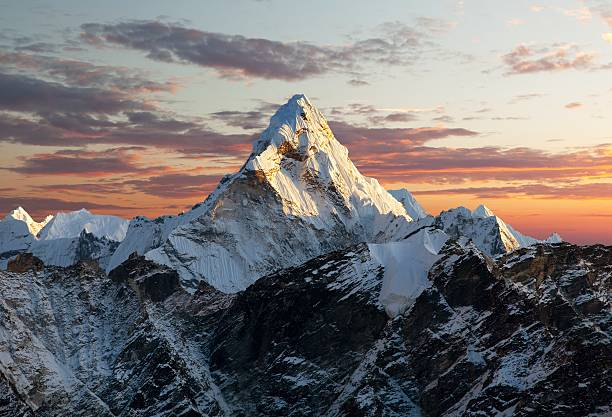
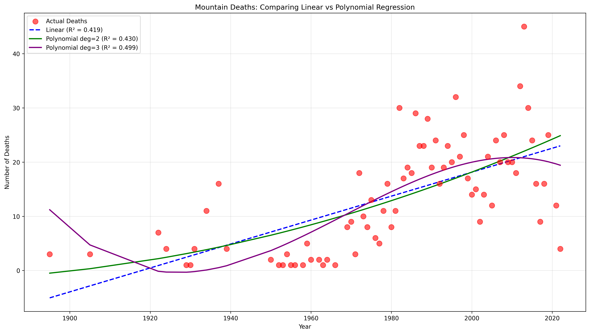
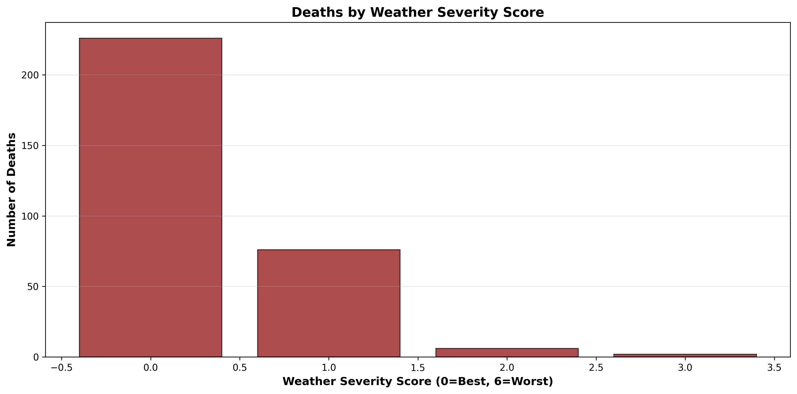
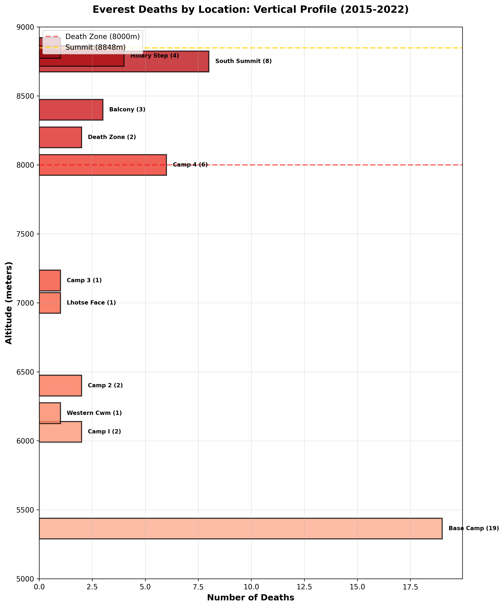
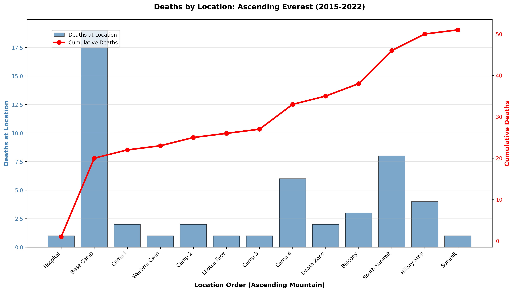

# Mountain Deaths Analysis
# Statistical Trends and Predictions


## Overview

A comprehensive statistical and machine learning analysis of mountaineering fatalities across the world's 14 highest peaks (1900s-2022), with a more in-depth analysis of Mount Everest deaths including weather data.

**Datasets:**
- **Historical Deaths Across 14 Eight-Thousanders (1900s-2022)**: A comprehensive record of 1,033 deaths across all 14 mountains above 8,000 meters, including Everest, K2, Kangchenjunga, Lhotse, Makalu, Cho Oyu, Dhaulagiri I, Manaslu, Nanga Parbat, Annapurna I, Gasherbrum I, Gasherbrum II, Broad Peak, and Shishapangma. This dataset includes dates, nationalities, causes of death, and geographic coordinates.
- ***Everest-Specific Analysis (2015-2022)**: A detailed modern dataset focusing exclusively on Mount Everest deaths from 2015-2022, featuring enriched variables including climber age, gender, experience level, altitude of death, specific location, weather conditions, and expedition company affiliation.

**Key Questions:**
1. Are deaths increasing or decreasing over time?
2. Can we predict cause of death from available data?
3. Do independent climbers face different risks than commercial expeditions?
4. How much does weather influence mountaineering fatalities?

📚 **[See Full Analysis in Wiki](../../wiki)** for detailed methodology, complete results, and all visualizations.

---

## Key Findings

### 📈 Death Trends by Mountain

**Overall Trend (All 14 Mountains):**
- Deaths increasing globally (R² = 41.8%, p < 0.001)
- Pattern is real, not random chance
- If trend continues, 24.7 deaths are predicted in 2030.

**Individual Mountains:**
- **Increasing**: Everest (+0.0657/year), K2, Makalu, Gasherbrum I
- **Decreasing**: Annapurna I (-0.054/year), Nanga Parbat, Manaslu
- **Most predictable**: Annapurna I (R² = 24%, only mountain with p < 0.05)
- **No mountain has R² > 50%** - all remain highly unpredictable




**Takeaway:** While some peaks show clear trends, individual mountain deaths remain largely random year-to-year.

---

### ☁️ Weather Analysis: The Good Weather Paradox

**Weather Severity Scoring** (0=mild, 6=extreme):
- **55% of deaths occur in MILD weather** (severity 0)
  - Avg temp: -26°C, wind: 8 m/s
  - No extreme conditions present
- Only 4% occur in severe/extreme weather (severity 4-5)

**Cause of Death by Weather:**
- **Mild to moderate weather**: Altitude sickness dominates
- **Extreme weather**: Exhaustion becomes primary cause
- Wind speed (12.0%) is the most important weather predictor



**Takeaway:** **Good weather creates false sense of security.** Altitude sickness kills regardless of perfect conditions. Waiting for weather windows is not a sufficient safety strategy.

---

### 🤖 Machine Learning: The Limits of Prediction

**Predicting Cause of Death (14 Mountains):**
- Best Model: Random Forest (23.08% accuracy)
- Year is most important feature (37.7%)
- Nationality (27.3%) and Mountain (19.4%) also significant

**Predicting Cause of Death (Everest with Weather):**
- Best Model: Random Forest (20% accuracy)
- Small sample size of 2015-2022 if a factor that lead to unpredictability

**Predicting Death Altitude (Regression):**
- Weather conditions can reasonably predict the altitude of where death occurs (R² = 0.716)
- On average, model predictions are off by 548 meters.

**Weather vs. No Weather Data**
- Accuracy WITHOUT Weather: 38.46%
- Accuracy WITH Weather: 23.08%
- Weather does not improve predictions significantly

**Takeaway:** Despite comprehensive data (age, experience, route, season, expedition type, 6 weather variables), **individual deaths remain unpredictable.** Aggregate trends exist, but individual outcomes are determined by unmeasurable factors: split-second decisions, individual physiology, random events, cumulative fatigue.

---

### 💀 Death Zone Analysis

**Deaths Below vs In Death Zone (<8000m vs ≥8000m):**
- 64% of deaths occur in Death Zone
- Altitude sickness is #1 cause in both zones
- Commercial and independent climbers die at similar altitudes




---

## Visualizations

### Key Charts
- [Deaths by Mountain](images/deathsbymountain10.png) | [By Nationality](images/bynationality15.png) | [By Cause](images/causes15.png)
- [Deaths Over Time](images/overtime.png) | [Seasonal Pattern](images/seasonalpattern.png)
- [Age Distribution](images/everest_age_distribution_expedition_type.png) | [Altitude Distribution](images/everest_altitude_distribution_expedition_type.png)

**📊 [See All Visualizations in Wiki](../../wiki/Visualizations)**

---

## Technologies Used
Python 3.x • pandas • NumPy • matplotlib • scikit-learn • scipy • cartopy

---

## Repository Structure
```
├── README.md                    # This file
├── notebooks/                   # Jupyter analysis notebooks
├── images/                      # All visualizations
└── docs/                        # Detailed documentation
```

---

## Key Insights Summary

1. **Deaths are increasing globally** but with high unpredictability (R² < 50%)
2. **Individual mountains show mixed trends** - 7 increasing, 7 decreasing
3. **Everest deaths declining 2020-2025** but not yet statistically significant
4. **55% of deaths happen in good weather** - altitude is the real killer
5. **Machine learning fails** - deaths are fundamentally unpredictable
6. **Weather data adds minimal value** - weather alone does not improve predictions
7. **Commercial support helps navigation** but doesn't prevent altitude sickness
8. **Death altitude cannot be predicted** - where you die is essentially random
9. **Age matters more than experience** in predicting outcomes
10. **The Death Zone kills equally** - no expedition type is safer above 8,000m

**Bottom Line:** Modern data science reveals what mountaineers have always known - **high-altitude climbing remains inherently, irreducibly dangerous.** Safety improvements help at the margins, but individual survival depends on unmeasurable factors: genetics, moment-to-moment decisions, and chance.

---

## Author
Kerry Wehner

## Data Sources
Kaggle: Historical deaths on 14 eight-thousanders (1900s-2022)  
Weather data: Daily meteorological conditions for Everest region

📚 **[Read Full Analysis & Methodology in Wiki](../../wiki)**
