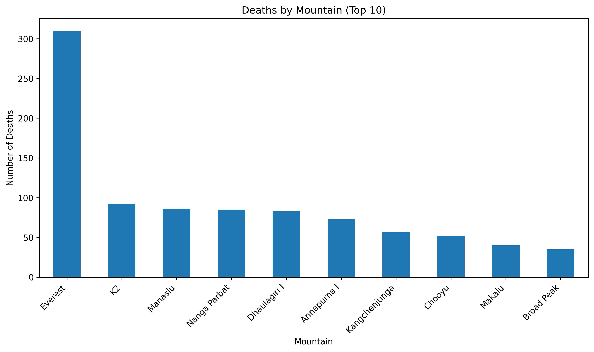
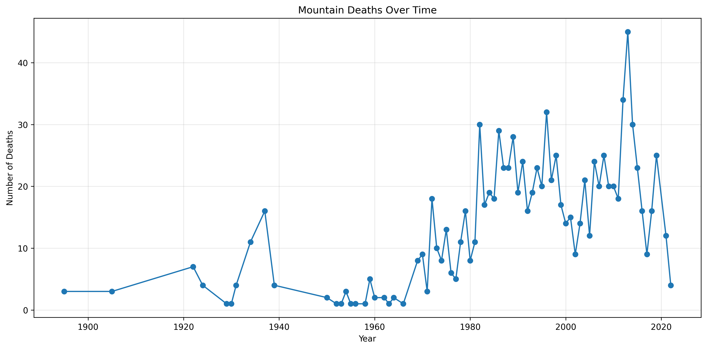
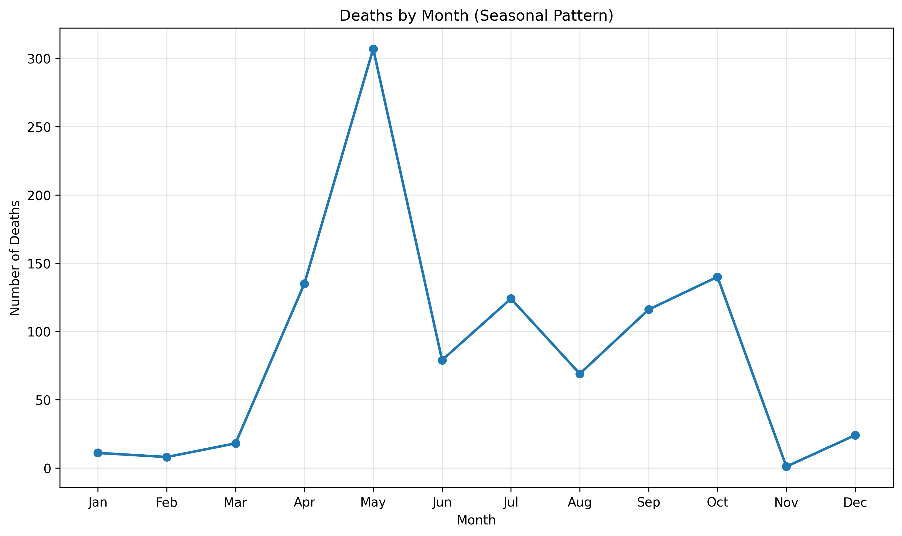
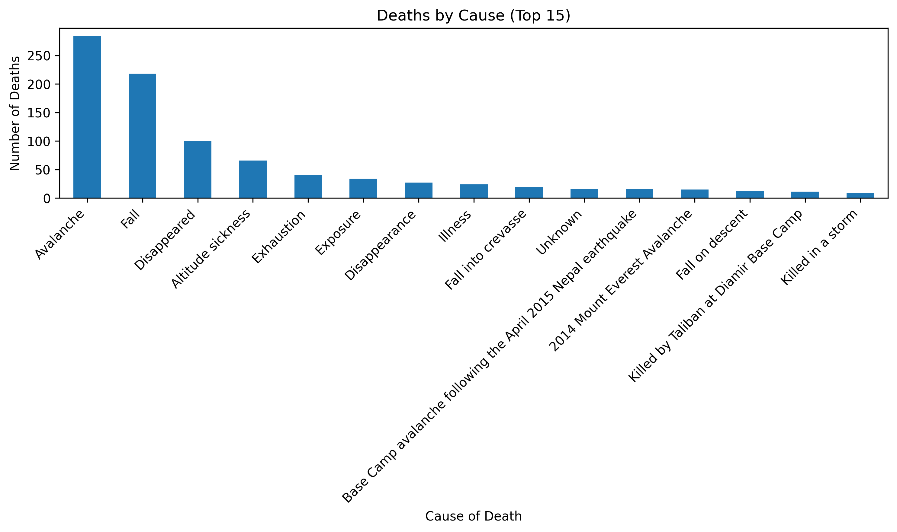
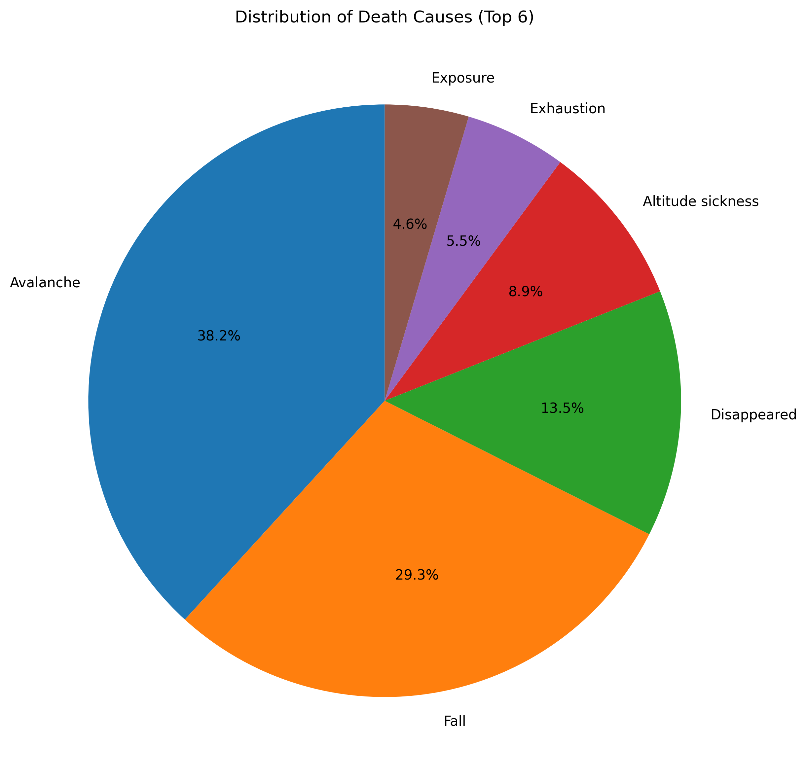
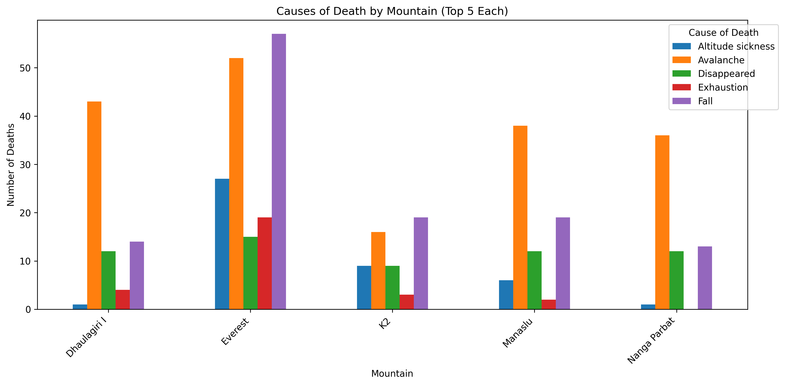

<h1 data-section-id="uzczyb" data-start="254" data-end="305">Statistical Analysis of Mountaineering Fatalities</h1>

This section explores statistical patterns in mountaineering fatalities using historical expedition data. The analysis focuses on where deaths occur, who is most affected, when fatalities happen, and the most common causes. Together these insights highlight the risks associated with high-altitude climbing and how those risks vary across mountains, seasons, and time.

<h1 data-section-id="7dddns" data-start="686" data-end="732">Global Distribution of Deaths</h1>

The maps below visualize the geographic distribution of mountaineering fatalities across major climbing regions.

<h3 data-section-id="d990xy" data-start="848" data-end="884">World Map of Fatalities</h3>

[Open Interactive Map](https://github.com/kwehner/MountaineeringAnalysis/blob/main/mountain_deaths_world_map.html)

<h3 data-section-id="1pk4oya" data-start="970" data-end="989">Map of the Southeast</h3>

[Open Interactive Map](https://github.com/kwehner/MountaineeringAnalysis/blob/main/maps/mountain_deaths_interactive_map.html)

<h1 data-section-id="64gtw9" data-start="1086" data-end="1106">Deaths by Mountain</h1>

Certain mountains account for a disproportionate number of fatalities due to their popularity, technical difficulty, and extreme altitude.

#### Percentage of Deaths by Mountain

| Mountain        | Percent of Deaths |
|-----------------|------------------|
| Everest         | 30.04% |
| K2              | 8.91% |
| Manaslu         | 8.33% |
| Nanga Parbat    | 8.24% |
| Dhaulagiri I    | 8.04% |
| Annapurna I     | 7.07% |
| Kangchenjunga   | 5.52% |
| Cho Oyu         | 5.04% |
| Makalu          | 3.88% |
| Broad Peak      | 3.39% |
| Gasherbrum I    | 3.29% |
| Lhotse          | 3.00% |
| Shishapangma    | 3.00% |
| Gasherbrum II   | 2.23% |

#### Deaths by Nationality

Nepal has the highest number of fatalities, reflecting the large number of <strong data-start="2450" data-end="2480">Sherpa climbers and guides</strong> who support high-altitude expeditions.

<h1 data-section-id="dlt69t" data-start="2526" data-end="2548">Fatalities Over Time</h1>

Mountaineering deaths have increased over the decades, particularly after the 1970s.

The rise in fatalities corresponds closely with the <strong data-start="2730" data-end="2803">commercialization and growing popularity of high-altitude expeditions</strong>, especially on peaks like Everest.

<h1 data-section-id="639yr9" data-start="2845" data-end="2864">Seasonal Patterns</h1>

Mountaineering fatalities show a strong seasonal pattern.

Deaths peak in <strong data-start="2989" data-end="2996">May</strong>, which coincides with the main Himalayan climbing window when weather conditions are most favorable and expedition traffic is highest.

<h1 data-section-id="1ykkaxt" data-start="3138" data-end="3155">Causes of Death</h1>

The most common causes of mountaineering fatalities are related to environmental hazards and extreme physical strain. Avalanches are hard to predict and altitude sickness can happen at any point on these mountains.

#### Top Causes of Death

<strong data-start="3397" data-end="3421">Avalanches and falls</strong> are among the leading causes, followed by altitude-related illnesses and exhaustion.

<h1 data-section-id="1azbky9" data-start="3513" data-end="3542">Causes of Death by Mountain</h1>

Different mountains present different risks. The chart below compares causes of death across the five most fatal mountains.

Key observations:

<ul data-start="3754" data-end="4161">
<li data-section-id="49qe5x" data-start="3754" data-end="3919">

<strong data-start="3756" data-end="3767">Everest</strong> has the highest number of <strong data-start="3794" data-end="3821">fall-related fatalities</strong>, likely due to crowded routes and technical sections such as the Hillary Step and Khumbu Icefall.

</li>
<li data-section-id="1qq8ajv" data-start="3920" data-end="3989">

<strong data-start="3922" data-end="3949">Altitude-related deaths</strong> appear frequently on the highest peaks.

</li>
<li data-section-id="mi9v3b" data-start="3990" data-end="4059">

<strong data-start="3992" data-end="4006">Avalanches</strong> are a major risk factor across nearly all mountains.

</li>
<li data-section-id="1puhn1p" data-start="4060" data-end="4161">

<strong data-start="4062" data-end="4089">Exhaustion and exposure</strong> remain significant contributors to fatal outcomes during summit pushes.

</li>
</ul>